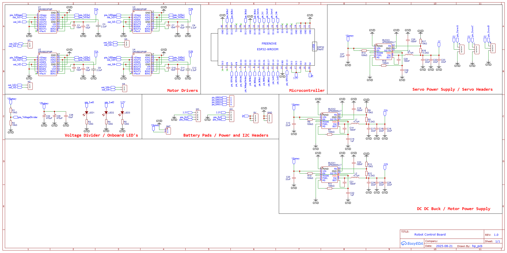

# Robot Control PCB (RPCB)

A custom **robot control PCB** designed for robotics applications. The robot control board uses an ESP32 to achieve motor driving, power management, and sensor interfacing into a single modular board for robotic vehicles and projects.

---

## Features

**Hardware**
- ESP32 microcontroller (dual-core) for parallel task execution
- Multiple motor driver ICs for DC and servo motors
- Buck converters for stable voltage supply to MCU and peripherals
- Servo and I2C headers for additional actuators or sensors
- Terminal for VBAT ± connection
- Onboard LED indicator for status signaling
- Voltage divider circuit for battery voltage monitoring
- 4-layer PCB stackup: SIGPWR | GND | GND | SIGPWR, optimized for signal integrity and power distribution
- Designed for integration into robotics platforms (cars, rovers, and other mobile robots)

**Firmware**
- Developed using **FreeRTOS** for multitasking on dual cores
- PWM generation for precise motor control
- GPIO for sensors, actuators, and status indicators
- ADC input for battery monitoring and analog sensors
- Timer-based tasks and interrupt-driven events for low-latency control
- Efficient task scheduling for real-time robotics applications

---

## Schematics & PCB Images

**Schematic**  
  

**PCB in example project**  
  

**PCB**  
  

---

## Description

The robot control board is designed as a general board which can be used to control DC motor's, servos and more. It integrates power management, motor driving, and sensor interfacing, making it suitable for a variety robotics projects.  

The ESP32 firmware takes full advantage of **dual-core processing and FreeRTOS**, separating motor control, sensor polling, and battery monitoring into concurrent tasks. PWM outputs and GPIO control ensure precise actuation of motors and servos, while ADC channels monitor battery voltage for safe operation. Timers and interrupts are used for responsive and low-latency control, critical in fast-moving robotics systems.

This PCB has been tested in a **robotic car platform**, demonstrating stable and reliable operation under real-world conditions. Its modular design allows expansion through I2C and servo headers for additional sensors and actuators.

---

## Usage

1. Connect motors, servos, and sensors to the designated headers.  
2. Provide VBAT power through the terminal.  
3. Flash the firmware to the ESP32 using the Arduino IDE.  
4. Firmware handles motor control, sensor reading, and battery monitoring in parallel.  
5. Use onboard LED for status or debugging indications.

---

## Tech Stack / Tools

- **MCU:** ESP32 with FreeRTOS  
- **Motor Control:** PWM, GPIO  
- **Sensors:** ADC, I2C  
- **Power:** Buck converters to step down battery voltage, voltage divider for battery monitoring  
- **PCB:** 4-layer stackup for signal integrity and power distribution  

---
